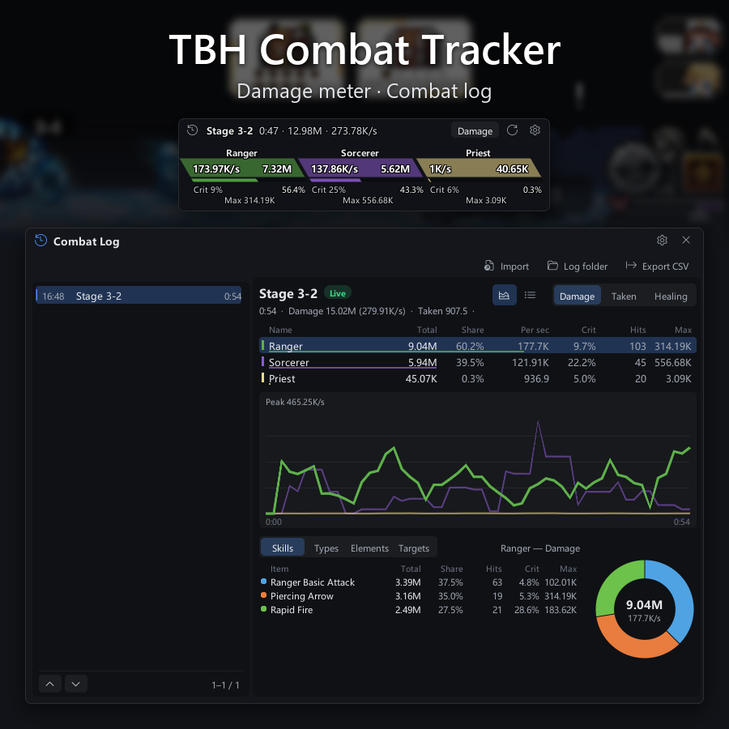

# TBH Combat Tracker

[简体中文](README.md) | **English**

A combat statistics panel for **TBH: Task Bar Hero**. A horizontal overlay that breaks down damage dealt,
damage taken and healing per hero; click any hero for a donut-chart breakdown by skill and by damage type;
statistics segment automatically per stage; CSV export. An ACT-style combat log window lets you review every
encounter of the session, and each session's combat events are saved to a log that can be imported and re-parsed.
Every setting can be changed in game. The interface text follows the game's language.

**Read-only statistics. It never modifies any game value.**

Currently aligned with game **1.2.8**, BepInEx **6.0.0-be.785**.



---

## Download

Grab the latest `TbhCombatTracker-vX.Y.Z.zip` from
[Releases](https://github.com/DPS-Love/tbh-combat-tracker/releases/latest).

## Install

### 1. Install BepInEx 6 IL2CPP

Download **`BepInEx-Unity.IL2CPP-win-x64-6.0.0-be.785.zip`** from
<https://builds.bepinex.dev/projects/bepinex_be> and extract it into the game's root folder
(next to `TaskBarHero.exe`):

```
TaskbarHero\
├── TaskBarHero.exe
├── winhttp.dll          ← from BepInEx
├── doorstop_config.ini
├── dotnet\
└── BepInEx\
```

> Use the BE build from the build server, not `6.0.0-pre.2` from GitHub Releases: that one predates Unity 6 and cannot read this game.

### 2. Launch the game once

On its first run BepInEx generates interop assemblies, which **takes 1–3 minutes**. The window may look
frozen during that time; don't close it. You're done once this file exists:
`TaskbarHero\BepInEx\interop\Assembly-CSharp.dll`

### 3. Install the mod

Extract the `BepInEx` folder from the release zip over the game's root folder, so you end up with:

```
TaskbarHero\BepInEx\plugins\TbhCombatTracker.dll
```

Launch the game.

---

## Usage

| Key | Action |
|---|---|
| `F9` | Show / hide the overlay |
| `F8` | Open / close the combat log window |
| `F10` | Reset the current statistics (the old encounter moves to the combat log) |
| `F11` | Export the current encounter as a CSV to `BepInEx\TbhCombatTracker\` |

- Normally only the text and cards float over the game (outlined in black); move the cursor onto the overlay and a
  translucent background and the title-bar buttons fade in (the background opacity is in the settings)
- The overlay's title bar: the log icon at the far left opens the combat log; on the right are the view switch
  (**Damage / Taken / Healing**), reset and settings
- **Click a hero card** for details: basic attacks vs. each skill, and damage type / element shares
- Statistics segment per stage by default; the title shows the current stage name, with a repeat number when the same stage is auto-repeated, e.g. `Stage 3-2 #2`
- Drag any window to move it; positions are remembered. Hover an icon button for a tooltip

The game window is normally click-through. While the cursor is over a panel, click-through is lifted so
you can operate it, and restored as soon as the cursor leaves, so normal desktop use is unaffected.

### Combat log window

Open it with the log icon at the far left of the overlay's title bar (or `F8`). It is modelled on ACT's main window:

- **Left**: every encounter of this session, newest first; the one in progress is marked **Live**. Short fights
  such as bosses can be examined after they end by clicking them. The footer shows which rows you are looking at,
  out of how many
- Only the latest 20 encounters (adjustable) keep their full data in memory. Older ones stay in the list, greyed
  out with a floppy-disk icon, and are reloaded from this session's combat log when you open them, so the list
  always covers the whole session while memory use stays flat
- **Right**: the selected encounter — a combatant table for Damage / Taken / Healing (total, share, per second,
  crit, hits, max), each combatant's per-second curve over time (hover it to read any second), and a breakdown
  table and donut by skill / damage type / element / **target** (which monsters you hit; for Taken, which monsters
  hit you; for Healing, whom you healed). Click a table row to focus on that combatant; click it again or an empty
  spot to go back to the whole party. Breakdown rows and donut slices highlight each other on hover; scroll the
  table when it has more than 8 items. On the donut, items past the first 8 or too small to draw are grouped into
  a grey "Other" slice (grey dots in the table)
- The icons at the top right swap the lower half for an **event log**: every hit, hit taken and heal of the encounter
  in order (source, target, skill, amount, crit, type), filtered by the current view and selected combatant. The
  live encounter follows the newest events; finished encounters and imported logs are read back from the log file
- **Export CSV** at the top exports the selected encounter; **Log folder** opens the folder the logs are kept in

### Settings

The gear on the overlay or the combat log title bar opens the settings: UI scale, card slant, how encounters are
split, how many stay in memory, what is tracked, combat logs, updates, hotkeys and class colours. Changes are saved
to the config file right away; the few marked **Needs restart** take effect the next time the game starts.

### Combat logs

Every session writes its combat **events** (each hit, heal, stage change…) to a log:
`BepInEx\TbhCombatTracker\logs\tbh-date-time.tbhlog.gz`, about 0.2 MB per hour in practice, kept for 30 days by default.

**Import** in the combat log window opens any of these logs and **re-parses it with the current version**, so
statistics added in later updates also show up for old logs. Logs from other players can be imported too — just put
them in that folder. The format is documented in [combat log format](https://github.com/DPS-Love/tbh-combat-tracker/blob/main/docs/eventlog.md) (Chinese).

## Configuration

`BepInEx\config\dpslove.tbh.combattracker.cfg` is **created after the game has been launched once**.
Everything below can be changed in the in-game settings; if you edit the file directly, restart the game.

| Setting | Default | Description |
|---|---|---|
| `SegmentByStage` | true | Segment per stage; when off, a new segment starts after `IdleResetSeconds` seconds without damage |
| `KeepInMemory` | 20 | How many recent encounters keep their full data in memory; older ones reload from this session's log when opened. `0` keeps everything (so does turning `LogEvents` off) |
| `TrackIncoming` / `TrackHealing` / `TrackSkills` | true | Damage taken / healing / per-skill breakdown |
| `UiScale` | 1.0 | Interface scale |
| `SkewDegrees` | -30 | Skew angle of the hero cards; `0` for plain rectangles |
| `BackgroundOpacity` | 0.7 | Background opacity (0–1) of the overlay, breakdown and combat log windows; the overlay shows it only while the cursor is on it |
| `LogEvents` | true | Write combat logs; when off, the combat log window only has this session and cannot import |
| `LogRetentionDays` | 30 | Days to keep combat logs; `0` keeps them forever |
| `CheckUpdates` | true | Check for updates at startup (see below) |
| `AutoInstall` | false | Download and replace the DLL automatically when a new version is found; takes effect on restart |

The `[Colors]` section holds the card colours of the six classes (the settings offer a set of presets);
you can also edit the hex values directly (`#RGB` / `#RRGGBB` / `#RRGGBBAA`).

## Update notices

At startup the mod reads the repository's `manifest.json` once (**read only, nothing is uploaded**):

- **A newer version exists** → a banner at the top of the overlay. Click **Release** to download it yourself,
  or **Update** to let the mod download it, verify the SHA-256 and replace the file; takes effect after
  restarting the game
- **Your version is flagged as broken on your game version** → a red banner explaining why. **Nothing happens
  automatically**: click **Disable** to stop tracking for this session (restored on restart), update, or do nothing
- **The game updated and the mod hasn't caught up yet** → an amber notice; statistics may be missing,
  the game itself is unaffected

Set `CheckUpdates` to `false` if you'd rather stay offline. If a new version fails to load after an automatic
update, rename `BepInEx\plugins\TbhCombatTracker.dll.old` back to `TbhCombatTracker.dll` to roll back.

## About ban risk

The game ships Anti-Cheat Toolkit but enables only three detectors: speed hack, memory tampering and system
time. This mod touches none of them: it never writes memory, never changes the time, never touches saves.
**The injection detector is never started**, there is no mod-loader blacklist, and the client has
**no ban logic** when a detector fires. Full analysis and evidence in the
[anti-cheat notes](https://github.com/DPS-Love/tbh-combat-tracker/blob/main/docs/anticheat.md) (Chinese).

That said, what the server does with telemetry cannot be seen from the client. Back up your save at
`%USERPROFILE%\AppData\LocalLow\TesseractStudio\TaskBarHero` first. **Use at your own risk.**

## Uninstall

Delete `BepInEx\plugins\TbhCombatTracker.dll`. To remove BepInEx as well, delete `winhttp.dll`,
`doorstop_config.ini`, `.doorstop_version`, `dotnet\` and `BepInEx\` from the game's root folder, or use
"Verify integrity of game files" in Steam.

## FAQ

**The panel doesn't appear** — check `BepInEx\LogOutput.log` for `Loading [TBH Combat Tracker]`; if it's
missing, the DLL is most likely in the wrong place. Press `F9` to make sure it isn't just hidden.

**"The UI failed to load" in the top-left corner** — statistics and hotkeys still work; only the interface
could not be built. Please attach `BepInEx\LogOutput.log` to an issue.

**Stopped working after a game update** — expected: the game's code is obfuscated and method names can change
with every update. The log names the hook that failed to attach and the panel shows a notice; wait for a new
mod version. The game itself is unaffected.

**BepInEx vanished after verifying files in Steam** — Steam removes `winhttp.dll` as an extra file.
Reinstall BepInEx; the plugin and its config are untouched.

---

## Development

Building, reverse-engineering tools, re-aligning symbols after a game update and the release process are
covered in [docs/DEVELOPMENT.md](https://github.com/DPS-Love/tbh-combat-tracker/blob/main/docs/DEVELOPMENT.md) (Chinese).

## License and disclaimer

[MIT License](LICENSE).

This is an **unofficial fan project** for TBH: Task Bar Hero, not affiliated with or endorsed by the developer
TesseractStudio. The game and its assets belong to their respective rights holders; this project only reads the
game's observable runtime state for the player's own use and **contains and distributes no game assets**.
